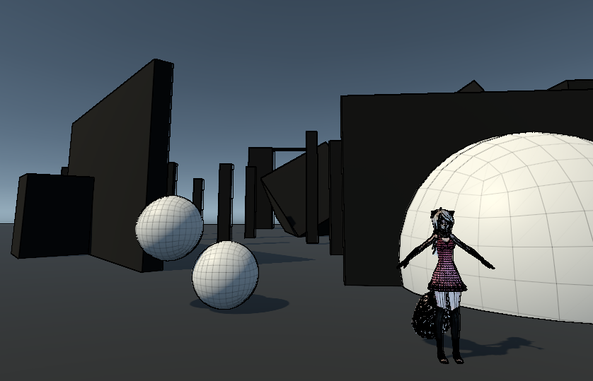
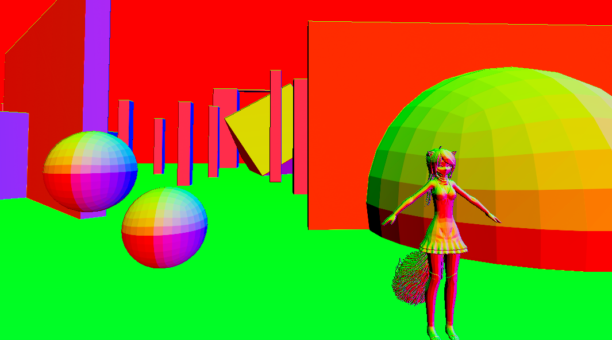
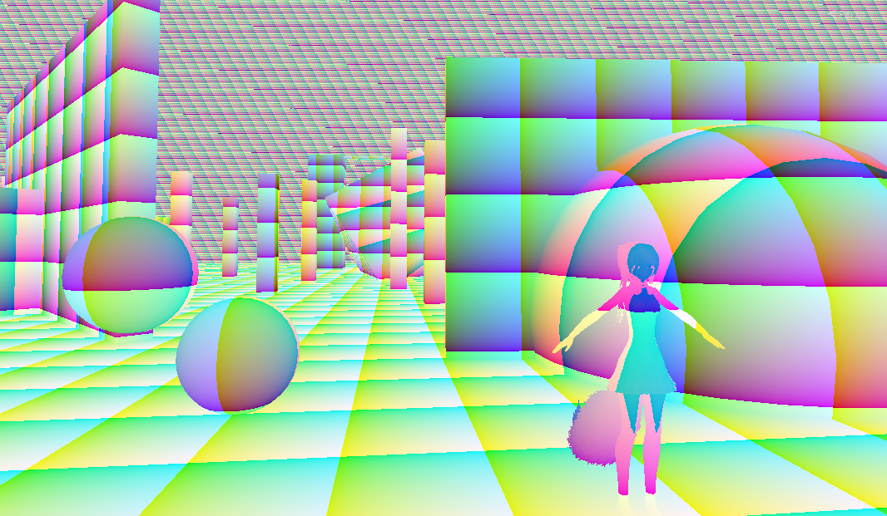
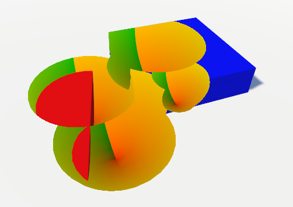
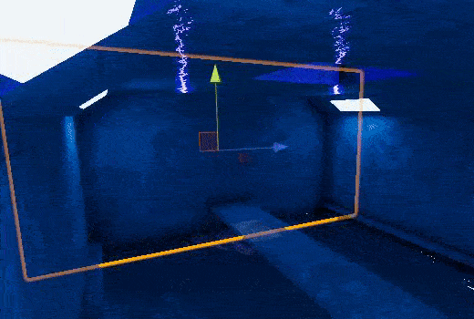
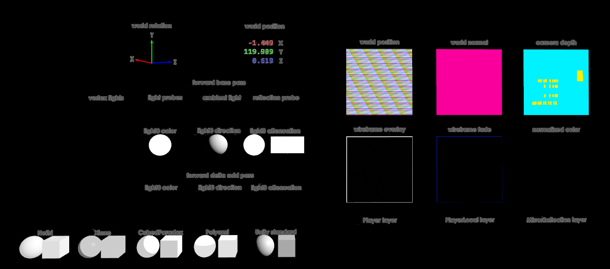

# Neitri-Unity-Shaders
Collection of shaders for Unity3D and VRChat.
World Normal and World Positon shaders have been used as basis for more interesting advanced effects, such as:
* triplanar decals
* color wave
* distortion wave
* cover everything in texture


# Simple shaders

## Types

* Shader marked with &#x1F6AA; render what is behind them with some effect, they don't go on your avatar but ideally on some "window" that you will look thru. Post processing might ruin results of these shaders.

* Shader marked with &#x1f4a1; need _CameraDepthTexture, to ensure _CameraDepthTexture is enabled please add a directional Light anywhere to your avatar (idally enabled only when the "window" is enabled) and set it's properties in the following way:<br>
<br>
The settings above should be optimized enough to not cause any additional render passes, if they do, the render passes should be low resolution.
Intensity value has to be over 0, because if it's 0 Unity considers the light as disabled.
You need to do this because Unity's forward rendering _CameraDepthTexture is enabled only if world has at least one light with shadows enabled or if game maker sets
```Camera.main.depthTextureMode = DepthTextureMode.Depth```. Shaders that use depth texture will be more imprecise or noisy the further you are from position 0,0,0. That is due to the nature of floating point numbers, it's a Unity thing.


## Censor &#x1F6AA;
Both VR and non VR see same censor squares.<br>
Censor square size decreases as distance to it increases.


## Clispace Raymarching &#x1F6AA;
Example on how to construct world space ray from clispace uv.
Useful as start for fully raymarched worlds.

## Wireframe Overlay &#x1F6AA;&#x1f4a1;
Overlays background color on top of original scene.


## Wireframe Fade &#x1F6AA;&#x1f4a1;
Fades into original scene color.


## World Normal Nice Slow &#x1F6AA;&#x1f4a1;
Slow because it uses two passes instead of one.


## World Normal Ugly Fast &#x1F6AA;&#x1f4a1;
Fast because it uses one pass, ugly because it uses `ddx` and `ddy` which work in 2x2 blocks.


## World Position &#x1F6AA;&#x1f4a1;


## World Cutout Sphere &#x1F6AA;&#x1f4a1;
Efficient single pass world cutout shader.
Uses ray sphere intersection, so works only as spherical cutout.


## Distance Fade Outline &#x1f4a1;
Fades outline (aka rim lighting) based on how far it is behind objects and how far it is from camera.
Add it to bottom of material list in Renderer component, so whole object is rendered again with this material.
[Used in migero's Foosball 1vs1 Or 2vs2](https://vrchat.net/home/launch?worldId=wrld_79b8ae0e-4c80-416f-9ef8-573fb10dfc34)


## Distance Fade Cube Volume



# Ported Shadertoy
Shaders ported from [Shadertoy](https://www.shadertoy.com/)
## Candy core 2
https://www.shadertoy.com/view/4sVXDz


# Prefabs/Worlds
Complex combination of shaders and specifc mesh/component/camera. Contains premade prefabs or example worlds.

## Depth Mirror

## GPU Particles
[Example World](https://www.vrchat.com/home/launch?worldId=wrld_f4bc450a-6998-4496-bac6-7a53f44dd3ae)

## Grafitti Wall 
[Example World](https://www.vrchat.com/home/launch?worldId=wrld_180cb4bc-3ff3-425b-a9f3-1860e01479ad)
Weak attempt at clone of [Just Graffitiǃ by: nyakome](https://vrchat.net/home/launch?worldId=wrld_96851736-d35a-46d6-8d17-da920a329537)

## Neitri Clock
Most up to date versions of my clock.
Also distributed thru [VRCMods](https://vrcmods.com/item/2515-Digital-Clock)


## Shader Debug
Prefab that helps with world light debugging.
I use it to debug issues with my Neitri MMD shader.


## Wireframe Projector
Wireframe Projector Prefab inspired by the one found [Avatar Testing‼ by Mimi's](https://vrchat.net/home/launch?worldId=wrld_8ef393c0-a985-4d7e-90f0-33ab10d41ee3)


# Neitri MMD
Shader I'am using on my avatar. [More info...](https://github.com/netri/Neitri-Unity-Shaders/tree/master/Neitri%20MMD)


# Credits
Everyone in "VRC Shader Development" discord

Mel0n - Wireframe Overlay idea<br>
Merlin - Wireframe Fade<br>
migero - Distance Fade Outline idea<br>
Nave - Script to generate 1 vert + X triangles mesh for Depth Mirror and GPU Particles<br>
error.mdl - original Depth Mirror idea, single texture fetch triplanar<br>
ScruffyRules - help with Depth Mirror debugging<br>
Dj Lukis.LT - [correct depth sampling with oblique view frustums](https://github.com/lukis101/VRCUnityStuffs/blob/master/Shaders/DJL/Overlays/WorldPosOblique.shader)<br>
d4rkpl4y3r - Shader Debug HDR detection idea

